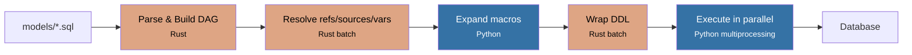

# Qraft

[](LICENSE)
[](https://www.python.org/downloads/)
[](https://www.rust-lang.org/)

Lightweight SQL templating and orchestration tool with a Rust core.

Qraft helps analytics and data engineers build SQL data models with dependency management, environment-based configuration, and parallel execution — without the overhead of Jinja2 or a heavy framework. Read **[Why Qraft?](docs/why_qraft.md)** to see how it compares to dbt and when it's the right fit.

## Features

- **SQL Templating** -- Reference other models with `ref('model')`, external tables with `source('name', 'table')`, and inject variables with `{{ var }}`
- **Macros** -- Reusable SQL logic via Python functions, called directly in your SQL and expanded at compile time
- **Materializations** -- `view`, `table`, `table_incremental` (with upsert), `ephemeral` (CTE injection), and `materialized_view`
- **Dependency Graph** -- Automatically builds a DAG from your SQL references, detects cycles, and validates your project
- **Parallel Execution** -- Topological sort produces independent batches that run concurrently
- **Environment Config** -- Single `project.yaml` with per-environment overrides (dev, staging, prod)
- **Rust Core** -- Parsing, compilation, DAG operations, and orchestration run in compiled Rust via PyO3
- **Multi-Engine Support** -- DuckDB (built-in), PostgreSQL, MySQL/MariaDB, Trino -- connect to any warehouse
- **Fuzzy Suggestions** -- Typo in a `ref()` or `source()`? During validation, Qraft suggests the closest match
- **Data Testing** -- Define `not_null`, `unique`, `accepted_values`, and custom tests in model front-matter; results written to `target/test_results.json`
- **Model Selection** -- dbt-style selectors: `model+` (descendants), `+model` (ancestors), `folder/*` (prefix), `tag:name` (tags)
- **Catalog Generation** -- Auto-generate interactive HTML documentation from your project with `qraft docs generate` and `qraft docs serve`
- **Dry-Run Mode** -- Preview compiled DDL without executing against the database
- **Model Front-Matter** -- Per-model YAML headers to override materialization, schema, tags, and enabled state

## Quick Start

```bash
# Install
pip install qraft

# Create a project
qraft init my_project
cd my_project

# Edit project.yaml and add SQL models under models/

# Validate your project
qraft validate --env local

# Compile SQL (resolve refs, sources, variables)
qraft compile --env local

# Run models against your database
qraft run --env local

# Browse your project in an interactive catalog
qraft docs generate --env local
qraft docs serve
```

## Project Structure

```
my_project/
  project.yaml          # Configuration: connections, sources, variables, environments
  models/
    bronze/
      stg_customers.sql  # SELECT * FROM source('raw', 'customers')
      stg_orders.sql
    silver/
      orders_enriched.sql # SELECT ... FROM ref('stg_orders') JOIN ref('stg_customers')
    gold/
      customer_summary.sql
  macros/
    utils.py             # Python macros: safe_divide(), classify_tier(), etc.
  target/                # Compiled output (auto-generated)
```

## SQL Templating

```sql
---
materialization: table
macros: [utils]
description: Customer summary with tier classification
tags: [gold]
---
SELECT
    c.customer_id,
    c.customer_name,
    COUNT(o.order_id)                          AS total_orders,
    SUM(o.order_total)                         AS lifetime_spend,
    safe_divide(SUM(o.order_total), COUNT(o.order_id))
                                               AS avg_order_value,
    classify_tier(SUM(o.order_total))          AS customer_tier
FROM ref('stg_customers') c
LEFT JOIN ref('int_orders_enriched') o ON c.customer_id = o.customer_id
WHERE o.order_total >= {{ min_order_amount }}
GROUP BY c.customer_id, c.customer_name
```

## How `ref()` Works

`ref('model_name')` creates a **dependency link** between two models. Qraft uses these links to:

- Build a DAG from your SQL references and validate it (missing models, typos, cycles)
- Determine a safe parallel execution order via topological sort
- Resolve each reference to a fully-qualified table name at compile time

### Example: three-tier model chain

**`models/bronze/stg_orders.sql`** — loads raw data from a source table:

```sql
SELECT
    id          AS order_id,
    customer_id,
    order_date,
    status
FROM source('raw', 'orders')
```

**`models/silver/int_orders_enriched.sql`** — references the bronze model:

```sql
SELECT
    o.order_id,
    o.customer_id,
    o.order_date,
    SUM(oi.quantity * oi.unit_price) AS order_total
FROM ref('stg_orders') o
LEFT JOIN ref('stg_order_items') oi ON o.order_id = oi.order_id
WHERE o.status = 'completed'
GROUP BY o.order_id, o.customer_id, o.order_date
```

**`models/gold/fct_customer_summary.sql`** — references silver and bronze models:

```sql
SELECT
    c.customer_id,
    c.customer_name,
    COUNT(o.order_id)  AS total_orders,
    SUM(o.order_total) AS lifetime_spend
FROM ref('stg_customers') c
LEFT JOIN ref('int_orders_enriched') o ON c.customer_id = o.customer_id
GROUP BY c.customer_id, c.customer_name
```

### What Qraft compiles to (with `schema: analytics`)

Each `ref('model')` is replaced with the fully-qualified name `schema.model`:

```sql
-- analytics.int_orders_enriched
CREATE OR REPLACE VIEW analytics.int_orders_enriched AS
SELECT
    o.order_id,
    o.customer_id,
    o.order_date,
    SUM(oi.quantity * oi.unit_price) AS order_total
FROM analytics.stg_orders o                                      -- ref resolved
LEFT JOIN analytics.stg_order_items oi ON o.order_id = oi.order_id  -- ref resolved
WHERE o.status = 'completed'
GROUP BY o.order_id, o.customer_id, o.order_date
```

```sql
-- analytics.fct_customer_summary
CREATE OR REPLACE VIEW analytics.fct_customer_summary AS
SELECT
    c.customer_id,
    c.customer_name,
    COUNT(o.order_id)  AS total_orders,
    SUM(o.order_total) AS lifetime_spend
FROM analytics.stg_customers c                                    -- ref resolved
LEFT JOIN analytics.int_orders_enriched o ON c.customer_id = o.customer_id  -- ref resolved
GROUP BY c.customer_id, c.customer_name
```

### Execution order

Qraft topologically sorts the DAG into parallel batches:

```
Batch 0 (parallel): stg_customers, stg_orders, stg_order_items, stg_products
Batch 1 (parallel): int_orders_enriched
Batch 2 (parallel): fct_customer_summary
```

Each batch runs fully before the next begins. Models within the same batch have no interdependencies and execute concurrently. See the full working project in [examples/ecommerce_basic/](examples/ecommerce_basic/).

## How It Works



Qraft compiles your SQL models through a Rust-powered pipeline: parse all SQL files, build and validate the dependency graph, resolve `ref()` / `source()` / `{{ var }}` references in batch, expand Python macros, then wrap each model in the appropriate DDL. Models execute in topological order — independent models within the same batch run concurrently via Python multiprocessing.

## Documentation

- [Getting Started](docs/getting_started.md) -- Installation, first project, first run
- [Core Concepts](docs/concepts.md) -- Models, DAG, sources, refs, variables
- [Configuration](docs/configuration.md) -- `project.yaml` reference
- [Code Reuse](docs/code_reuse.md) -- Macro system, qraft-utils, adapter support matrix
- [Materialization Types](docs/materialization_types.md) -- view, table, table_incremental, ephemeral, materialized_view
- [Testing](docs/testing.md) -- Built-in data testing framework
- [Catalog](docs/catalog.md) -- Interactive project documentation and lineage viewer
- [CLI Reference](docs/cli_reference.md) -- All commands and options
- [Why Qraft?](docs/why_qraft.md) -- Design philosophy and trade-offs
- [Migrating from dbt](docs/migrating_from_dbt.md) -- Side-by-side migration guide
- [Architecture](docs/architecture.md) -- How Qraft works under the hood
- [Feature Comparison](docs/feature_comparison.md) -- Feature comparison with dbt Core
- [Contributing](CONTRIBUTING.md) -- Development setup, testing, code structure
- [Roadmap](ROADMAP.md) -- What's planned next

## Examples

The [examples/](examples/) directory contains complete projects you can run:

- **[blog_analytics](examples/blog_analytics/)** -- Minimal blog analytics (5 models) showing how `ref()` links models, with front-matter descriptions and tags. Docker: PostgreSQL source → Trino/Iceberg warehouse
- **[ecommerce_basic](examples/ecommerce_basic/)** -- 3-tier e-commerce model (8 models) with macros, `table`/`ephemeral` materializations, and reusable SQL functions. Docker: MariaDB source → Trino/Iceberg warehouse
- **[saas_analytics](examples/saas_analytics/)** -- Multi-source SaaS analytics (17 models) with `table_incremental` materialization, ephemeral CTEs, macros, schema overrides, and `unique_key` upserts. Docker: PostgreSQL (3 schemas) → Trino/Iceberg warehouse
- **[datalakehouse_trino](examples/datalakehouse_trino/)** -- Shared Trino/Iceberg Docker infrastructure used by the examples above

## Database Support

| Engine         | Install                       | Use case                          |
|----------------|-------------------------------|-----------------------------------|
| DuckDB         | included                      | Local development, embedded OLAP  |
| PostgreSQL     | `pip install qraft[postgres]` | Application DBs, simple warehouse |
| MySQL/MariaDB  | `pip install qraft[mysql]`    | Application DBs                   |
| Trino          | `pip install qraft[trino]`    | Data warehouse, federated queries |

Install all engines at once: `pip install qraft[all-engines]`

### Tested Versions

The following versions are used in the [example projects](examples/) and are the versions Qraft is regularly tested against. Server versions come from the Docker images in each example's `docker-compose.yml`; driver versions are locked in `uv.lock`.

| Engine | Python Driver | Driver Version | Server Version |
|--------|--------------|----------------|----------------|
| DuckDB | `duckdb` | 1.5.0 | (embedded) |
| PostgreSQL | `psycopg` | 3.3.3 | PostgreSQL 17 |
| MySQL/MariaDB | `pymysql` | 1.1.2 | MariaDB 11.7 |
| Trino | `trino` | 0.337.0 | Trino 480 |

Other versions may work but are not regularly tested. The minimum driver requirements are: duckdb >= 1.0, psycopg >= 3.1, pymysql >= 1.1, trino >= 0.328.

Each example includes a `docker-compose.yml` that sets up source databases and a Trino/Iceberg warehouse. Run `docker compose up -d` then `qraft run --env docker`.

## Requirements

- Python 3.11+
- Rust toolchain (for building from source)

## Contributing

Contributions are welcome! See [CONTRIBUTING.md](CONTRIBUTING.md) for development setup and guidelines.

Please note that this project follows the [Contributor Covenant Code of Conduct](CODE_OF_CONDUCT.md).

## Security

To report a security vulnerability, please see [SECURITY.md](SECURITY.md).

## License

MIT -- see [LICENSE](LICENSE) for details.
