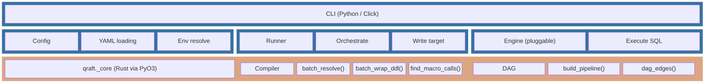
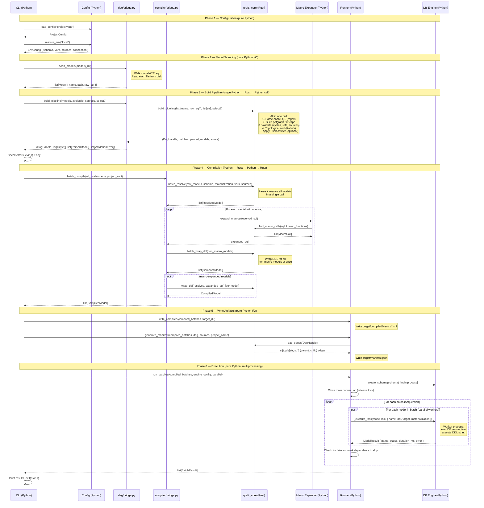
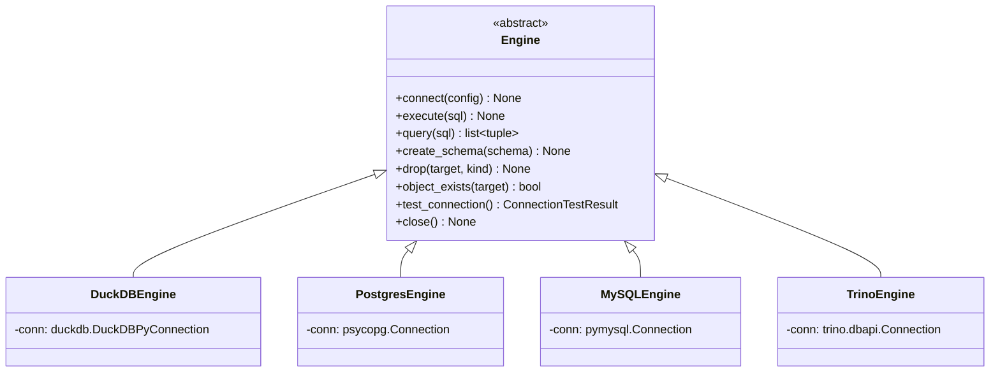
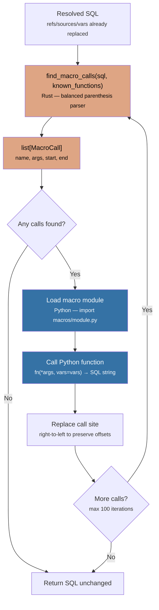
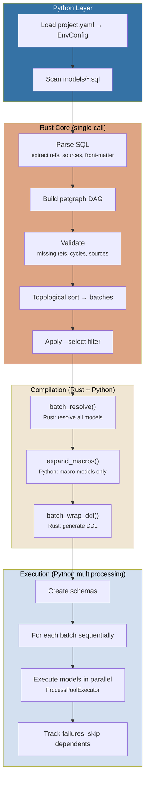

# Architecture

## Overview

Qraft is a hybrid Rust/Python application. Performance-critical operations (parsing, DAG construction, topological sorting) run in compiled Rust, while configuration, CLI, database engines, orchestration, and the test harness are in Python. Batch execution uses Python's `multiprocessing` for true parallelism — each worker process gets its own database connection and Python interpreter.



| Component | Language | Responsibility |
|-----------|----------|----------------|
| **CLI** | Python (Click) | Entry point — parses commands (`run`, `compile`, `show`, `validate`), loads config, invokes the runner |
| **Config** | Python | Loads `qraft_project.yml`, resolves environment variables, builds source/variable maps |
| **Runner** | Python | Orchestrates the full pipeline: scan models → build pipeline → compile → execute batches in parallel |
| **Engine** | Python | Pluggable database adapter — executes compiled SQL against the target warehouse |
| **Compiler** | Rust | Batch-resolves `ref()`, `source()`, `{{ var }}`, then generates the final executable SQL by wrapping the query in the appropriate statement (`CREATE VIEW`, `CREATE TABLE AS`, `INSERT INTO`, etc.) based on the model's materialization strategy. Exposes `batch_resolve()`, `batch_wrap_ddl()`, and `find_macro_calls()` |
| **DAG** | Rust | Builds the dependency graph, validates it, topologically sorts into parallel batches, and filters by `--select` pattern. Exposes `build_pipeline()` (consolidated) and `dag_edges()` |

## Project Layout

```
qraft/
├── python/
│   ├── qraft/                     # Main Python package
│   │   ├── cli.py                 # Click CLI entry point
│   │   ├── config/                # YAML loading + environment resolution
│   │   ├── compiler/              # Python-to-Rust bridge + macro expansion
│   │   │   ├── bridge.py          # Compile pipeline: resolve → macros → DDL
│   │   │   ├── macro_expander.py  # Expand macro calls in SQL
│   │   │   └── macro_loader.py    # Load Python macro modules
│   │   ├── dag/                   # Python-to-Rust bridge for DAG ops
│   │   ├── engine/                # Database engine abstraction
│   │   │   ├── base.py            # Abstract Engine class
│   │   │   ├── duckdb_engine.py   # DuckDB
│   │   │   ├── postgres_engine.py # PostgreSQL
│   │   │   ├── mysql_engine.py    # MySQL/MariaDB
│   │   │   └── trino_engine.py    # Trino
│   │   ├── runner/                # Pipeline orchestration
│   │   ├── manifest.py            # Manifest generation (target/manifest.json)
│   │   └── utils/                 # Env var substitution, output formatting
│   └── qraft-utils/               # Pip-installable macro library
│       └── qraft_utils/
│           ├── scalar.py          # surrogate_key, safe_divide, etc.
│           ├── conditions.py      # Reusable WHERE/HAVING builders
│           ├── structural.py      # pivot, union_relations, star
│           ├── date.py            # Date spine utilities
│           └── engine.py          # Engine-specific helpers
├── rust/                          # Rust crate (compiled to Python extension)
│   └── src/
│       ├── lib.rs                 # PyO3 module exports
│       ├── types.rs               # Shared types (ParsedSQL, CompiledModel, etc.)
│       ├── errors.rs              # Error types with PyErr conversion
│       ├── compiler/              # SQL parsing, macro detection, resolution
│       └── dag/                   # Graph operations
└── examples/                      # Example projects
```

## Data Flow

A typical `qraft run --env local` executes this pipeline:

```
1. Load Config
   project.yaml → ProjectConfig → resolve_env("local") → EnvConfig

2. Scan Models
   models/**/*.sql → [Model { name, path, raw_sql }]

3. Build Pipeline (single Rust call)
   build_pipeline(raw_models, available_sources, select?) performs:
     a. Parse each SQL → extract refs/sources/front-matter
     b. Build directed graph: model → [dependencies] → DagHandle
     c. Validate: missing refs, undeclared sources, cycles → [ValidationError]
     d. Topological sort (Kahn's algorithm) → [[batch0], [batch1], ...]
     e. Apply --select filter if provided → filtered batches
   Models are grouped into batches by dependency depth:
     - batch0: models with no dependencies (leaf nodes)
     - batch1: models whose dependencies are all in batch0
     - batchN: models whose dependencies are all in batch0..N-1
   Models within the same batch have no dependencies on each other,
   so they can execute in parallel. Batches run sequentially.
   Result: (DagHandle, batches, parsed_models, errors)

4. Compile
     a. Batch resolve all models (single Rust call) → list[ResolvedModel]
     b. Expand macros where declared (Python) → modified SQL strings
     c. Batch wrap DDL for non-macro models (single Rust call) → list[CompiledModel]
        Individual wrap_ddl for macro-expanded models
   Write compiled SQL to target/compiled/<env>/*.sql (Python)
   Write target/manifest.json (Python) — nodes, DAG edges, sources, batches

5. Execute
   For each batch (sequential):
     For each model in batch (parallel):
       Execute DDL against database engine
   Result: [BatchResult]
```

### Sequence Diagram: Python-Rust Boundary

The diagram below shows every point where data crosses the Python↔Rust boundary during `qraft run --env local`. Arrows into the Rust box are Python→Rust calls; arrows back are return values.



### Data Types Crossing the Boundary

Every call between Python and Rust exchanges data through PyO3's automatic type conversion. The table below documents the exact types on each side.

#### Python → Rust (function arguments)

| Data | Python type | Rust type | Example |
|------|-------------|-----------|---------|
| Raw SQL | `str` | `&str` | `"SELECT * FROM {{ source('raw', 'users') }}"` |
| Model name | `str` | `&str` | `"customers"` |
| Schema | `str` | `&str` | `"analytics"` |
| Materialization | `str` | `&str` | `"table"`, `"view"`, `"ephemeral"` |
| Variables | `dict[str, str]` | `HashMap<String, String>` | `{"region": "us_west"}` |
| Sources | `dict[str, SourceInfo]` | `HashMap<String, SourceInfo>` | Source name → database/schema |
| Parsed models | `list[ParsedModel]` | `Vec<ParsedModel>` | Constructed via `ParsedModel(name, refs, sources)` |
| Raw models | `list[tuple[str, str]]` | `Vec<(String, String)>` | `[("customers", "SELECT ..."), ...]` — used by `build_pipeline` and `batch_resolve` |
| Available sources | `list[str]` | `Vec<String>` | `["raw.users", "raw.orders"]` |
| Known macro functions | `list[str]` | `Vec<String>` | `["cents_to_dollars", "generate_date_range"]` |
| Ephemeral models | `list[EphemeralModel]` | `Vec<EphemeralModel>` | CTE name + compiled body + deps |
| DAG handle | `DagHandle` | `&DagHandle` | Opaque — passed back without inspection |
| Select pattern | `str` (optional) | `Option<String>` | `"+customers"`, `"tag:pii"` — passed to `build_pipeline`, tags built internally from front-matter |

#### Rust → Python (return values)

| Data | Rust type | Python type | Description |
|------|-----------|-------------|-------------|
| `ParsedSQL` | `#[pyclass]` struct | Frozen object | `.refs: list[str]`, `.sources: list[tuple[str,str]]`, `.variables: list[str]`, `.body: str`, `.front_matter: dict or None` |
| `ResolvedModel` | `#[pyclass]` struct | Frozen object | `.resolved_sql: str`, `.macros: list[str]`, `.name`, `.target`, `.materialization`, `.unique_key` |
| `CompiledModel` | `#[pyclass]` struct | Frozen object | `.compiled_sql: str`, `.ddl: str`, `.name`, `.target`, `.materialization`, `.refs`, `.sources`, `.tags`, `.enabled` |
| `DagHandle` | `#[pyclass]` struct | Opaque object | Contains `petgraph::DiGraph` — never inspected from Python, only passed back to Rust |
| `ValidationError` | `#[pyclass]` struct | Frozen object | `.model: str`, `.error_type: str`, `.message: str`, `.suggestion: str or None` |
| `MacroCall` | `#[pyclass]` struct | Frozen object | `.name: str`, `.args: list[str]`, `.start: int`, `.end: int` |
| Batches | `Vec<Vec<String>>` | `list[list[str]]` | Topologically sorted execution layers |
| Edges | `Vec<(String, String)>` | `list[tuple[str, str]]` | `(parent_name, child_name)` pairs |

### Key Design Decisions

**Batch compilation** — Compilation uses `batch_compile()` which minimizes Rust boundary crossings to 2 (instead of 2N for N models). The pipeline: (1) `batch_resolve()` — single Rust call parses and resolves all models; (2) Python expands macros only for models that declare them; (3) `batch_wrap_ddl()` — single Rust call wraps DDL for all non-macro models, with individual `wrap_ddl()` calls for macro-expanded models.

```
Rust: batch_resolve(all_models) → list[ResolvedModel]
Python: expand_macros() for models with macros (calls Rust find_macro_calls() internally)
Rust: batch_wrap_ddl(non_macro_models) → list[CompiledModel]
Rust: wrap_ddl(resolved, expanded_sql) for each macro model → CompiledModel
```

**Opaque DAG handle** — `DagHandle` wraps a `petgraph::DiGraph` that Python never inspects. Python receives it from `build_pipeline()` and passes it back to `dag_edges()` for manifest generation. Model selection now happens inside `build_pipeline` itself. This keeps graph traversal entirely in Rust while Python controls the orchestration flow.

**String-based boundary** — All data crossing the boundary is strings, string lists, string tuples, or string→string maps. There are no complex nested objects or binary data. PyO3 handles the conversion automatically. The PyO3 `#[pyclass]` structs returned to Python are frozen (immutable) — Python reads their attributes but never mutates them.

**Execution stays in Python** — After compilation, the `CompiledModel.ddl` string is the only data needed for execution. The runner extracts this string and passes it to database engines via Python's multiprocessing. No Rust code is involved in the execution phase.

## Rust Core

The Rust crate (`qraft-core`) is compiled into a Python extension module via [PyO3](https://pyo3.rs) and [maturin](https://maturin.rs). It exposes functions and classes to Python as `qraft._core`.

### Compiler Module

**`compiler::parser`** -- Regex-based SQL parser.

Uses compiled static regexes to extract:
- `ref('...')` calls → `Vec<String>`
- `source('...', '...')` calls → `Vec<(String, String)>`
- `{{ var }}` expressions → `Vec<String>`
- YAML front-matter → `Option<HashMap<String, String>>`

**`compiler::macro_parser`** -- Finds macro function calls in SQL using balanced parenthesis matching. Extracts function names and arguments for expansion by the Python macro expander.

**`compiler::resolver`** -- String replacement engine.

Takes a `ParsedSQL` and environment config, performs string substitution:
- `ref('model')` → `schema.model`
- `source('name', 'table')` → `[database.]schema.table`
- `{{ var }}` → value from vars
- Wraps in DDL based on materialization (view, table, table_incremental, ephemeral, materialized_view)

### DAG Module

**`dag::builder`** -- Constructs a `petgraph::DiGraph` from parsed models. Each model is a node; each `ref()` creates a directed edge from dependency to dependent. Also exposes `edges()` to extract all `(parent, child)` tuples for manifest generation.

**`dag::validator`** -- Validates the graph:
- Missing refs: model references a `ref()` target that doesn't exist as a node
- Missing sources: model uses a `source()` not declared in config
- Cycles: uses `petgraph::algo::is_cyclic_directed`
- Fuzzy suggestions via `strsim::jaro_winkler` (threshold 0.8)

**`dag::sorter`** -- Kahn's algorithm for topological sort. Produces `Vec<Vec<String>>` where each inner vec is a parallel batch.

**`dag::selector`** -- Pattern-based model selection. Supports exact match, `+model`, `model+`, `+model+`, and `folder/*` prefix patterns. Uses BFS on the graph (and reversed graph for ancestors).

## Python Layer

### Config

- **`loader.py`** -- Reads `project.yaml`, parses YAML, constructs `ProjectConfig`
- **`resolver.py`** -- Deep-merges base config with environment overrides, produces `EnvConfig`
- **`models.py`** -- Dataclasses: `ConnectionConfig`, `SourceConfig`, `EnvConfig`, `ProjectConfig`, `Model`

### Engine

Abstract `Engine` base class with pluggable implementations:



Implemented engines: `DuckDBEngine`, `PostgresEngine`, `MySQLEngine`, `TrinoEngine`. Each engine handles database-specific DDL differences (e.g., materialized views on Postgres/Trino only).

### Runner

Orchestrates the full pipeline: scan → build_pipeline → compile → write → execute. Also handles `write_compiled()` to write resolved SQL files to `target/`.

Batch execution uses `ProcessPoolExecutor` from Python's `multiprocessing` module. Each worker process initializes its own database connection via `_init_worker()`, then executes model DDL statements via `_execute_task()`. The main process tracks failures across batches and skips models whose dependencies failed.

### Manifest

**`manifest.py`** -- Generates `target/manifest.json` after compilation. The manifest is a JSON artifact containing:
- **`nodes`** -- every compiled model with its SQL, DDL, target, materialization, refs, sources, description, and tags
- **`parent_map`** / **`child_map`** -- adjacency lists derived from DAG edges (model-to-model) and source references
- **`sources`** -- source definitions from project config
- **`batches`** -- topologically sorted execution layers

Both `qraft compile` and `qraft run` produce a manifest. It serves as the single source of truth for the dependency graph and will power future documentation generation.

### Macro System



- **`compiler/macro_loader.py`** -- Discovers and loads Python modules from the `macros/` directory
- **`compiler/macro_expander.py`** -- Finds macro function calls in resolved SQL and replaces them with their expansion output. Uses the Rust `find_macro_calls` function for parsing, then calls the Python functions to generate SQL

The macro pipeline runs between resolution and DDL wrapping: `batch_resolve()` → `expand_macros()` → `batch_wrap_ddl()` / `wrap_ddl()`.

### Model Execution Flow

The diagram below shows the full lifecycle of `qraft run --env local`:



### Bridge Modules

`compiler/bridge.py` and `dag/bridge.py` are thin wrappers that translate between Python types and the Rust `_core` module. They handle model scanning (filesystem I/O), type conversion, and calling Rust functions.

## Build System

- **maturin** -- Builds the Rust crate into a Python extension wheel
- **PyO3** -- Rust-Python bindings (automatic type conversion, GIL management)
- **Cargo** -- Rust dependency management
- **pip/uv** -- Python dependency management

```bash
make dev          # maturin develop (compile + install for dev)
make test         # cargo test + pytest
make build        # maturin build --release (produce wheel)
```

## Key Dependencies

### Rust
| Crate | Purpose |
|-------|---------|
| `pyo3` | Python bindings and extension module |
| `regex` | SQL template parsing |
| `petgraph` | Directed graph for DAG |
| `strsim` | Fuzzy string matching for suggestions |
| `thiserror` | Error type derivation |

### Python
| Package | Purpose |
|---------|---------|
| `click` | CLI framework |
| `pyyaml` | YAML config parsing |
| `python-dotenv` | `.env` file loading |
| `duckdb` | DuckDB database client |
| `rich` | Terminal formatting and colors |
