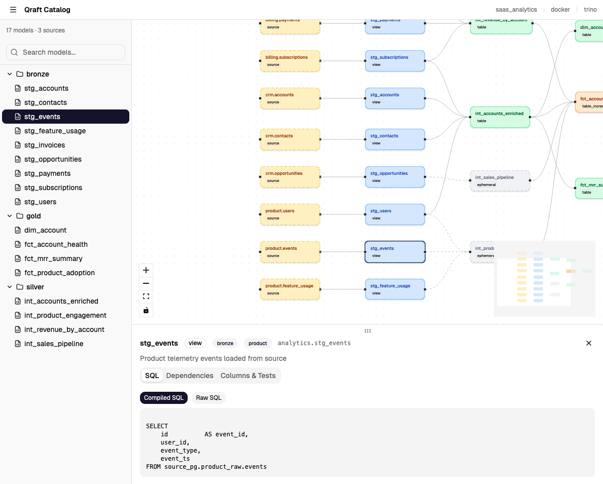

# Catalog

Qraft ships an interactive catalog — a single-page React app that lets you explore your project's model lineage, SQL, dependencies, and test results in a browser. No external dependencies are required; the app is pre-built and bundled with the Python package.



## Quick Start

```bash
# Generate the catalog for your environment
qraft docs generate --env dev

# Open it in the browser
qraft docs serve
```

Then visit [http://localhost:8080](http://localhost:8080).

## Generating the Catalog

```bash
qraft docs generate --env <environment> [options]
```

| Option | Default | Description |
|--------|---------|-------------|
| `--env` | *(required)* | Target environment |
| `--select <pattern>` | all models | Only include models matching the pattern |
| `--target-dir` | `target` | Directory where catalog files are written |

**What happens under the hood:**

1. If `target/manifest.json` exists (from a prior `compile` or `run`), it is used directly. Otherwise Qraft compiles the project first.
2. The pre-built `index.html` is copied from the installed package into `<target-dir>/catalog/`.
3. `manifest.json` is copied alongside it. If `test_results.json` exists (produced by `qraft test` or `qraft build`), it is included too.

```bash
# Generate for production
qraft docs generate --env prod

# Generate only staging models
qraft docs generate --env dev --select "stg_*"

# Custom output directory
qraft docs generate --env dev --target-dir out
```

## Serving the Catalog

```bash
qraft docs serve [options]
```

| Option | Default | Description |
|--------|---------|-------------|
| `--port` | `8080` | Port to serve on |
| `--target-dir` | `target` | Directory containing the generated catalog |

The server uses Python's built-in `http.server` — no extra dependencies needed. Press `Ctrl+C` to stop.

```bash
# Default port
qraft docs serve

# Custom port
qraft docs serve --port 3000
```

> **Note:** You must run `qraft docs generate` before `qraft docs serve`. The serve command will error if `target/catalog/` does not exist.

## UI Overview

The catalog is organized into four areas: a header bar, a collapsible sidebar, the main lineage graph, and a detail panel that appears when you select a model.

### Header

The header displays your **project name**, **environment**, and **connection type** on the right side. On the left you'll find the sidebar toggle and edge-style switcher (Smooth Step, Bezier, or Straight lines).

### Sidebar

- **Model tree** — a folder-based explorer showing all models organized by their file path. Click a model name to select it.
- **Search** — filter models by name in real time.

Toggle the sidebar open or closed with the hamburger menu button.

### Lineage Graph

The main area renders an interactive DAG of your entire project:

- **Pan and zoom** — scroll to zoom, click-and-drag to pan.
- **Click a node** to select it and open the detail panel.
- **Color-coded nodes** — each materialization type (view, table, ephemeral, incremental, materialized view) has a distinct color so you can scan the graph at a glance.
- **Edge styles** — switch between Smooth Step, Bezier, and Straight lines from the header controls.

Source nodes are also rendered in the graph, distinguished visually from model nodes.

### Detail Panel

When you click a model, a panel opens in the bottom 40% of the screen with three tabs:

#### SQL Tab

Shows both the **raw SQL** (as written in your `.sql` file) and the **compiled SQL** (with all `ref()`, `source()`, and macro calls resolved). Useful for debugging compilation output.

#### Dependencies Tab

Lists the model's **upstream** (parent) and **downstream** (child) dependencies. Click any dependency name to navigate to that model in the graph.

#### Columns & Tests Tab

Displays column definitions from the model's YAML front-matter, including descriptions. If test results are available (from `qraft test` or `qraft build`), pass/fail counts are shown per model.

## Including Test Results

To see test results in the catalog, run tests before generating:

```bash
# Option 1: run + test in one step
qraft build --env dev

# Option 2: run tests separately
qraft run --env dev
qraft test --env dev

# Then generate the catalog
qraft docs generate --env dev
```

The `build` and `test` commands write `target/test_results.json`. When this file exists at generation time, the catalog picks it up automatically.

## Manifest Contents

The catalog reads from `manifest.json`, which contains:

| Field | Description |
|-------|-------------|
| `metadata` | Project name, environment, schema, connection type, generation timestamp |
| `nodes` | All compiled models with raw SQL, compiled SQL, DDL, materialization, refs, sources, descriptions, and tags |
| `sources` | External source definitions (schema, database, tables) |
| `parent_map` | Upstream dependencies for each model (including source references) |
| `child_map` | Downstream dependents for each model |
| `batches` | Execution order (topologically sorted groups) |

## How It Works

The catalog is a React SPA built with Vite, TypeScript, Tailwind CSS, shadcn/ui, and [@xyflow/react](https://reactflow.dev/) for graph visualization. It is compiled at build time into a single self-contained `index.html` (~250KB gzipped) using `vite-plugin-singlefile`, so all JavaScript, CSS, and assets are inlined.

At runtime, the app fetches `manifest.json` and `test_results.json` via relative URLs — no API server required. This means the generated catalog is fully **offline-capable**: once generated, it works without an internet connection.

The catalog source lives in `catalog_app/` in the repository. End users never need Node.js — the pre-built HTML is shipped inside the Python package.
