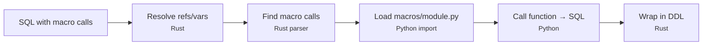

# Code Reuse in Qraft

Qraft offers several strategies for sharing SQL logic across models: variable chains and Python macros.

---

## Current mechanisms (work today, no changes needed)

### `{{ var }}` chains

The variable resolver runs multiple passes (default: **10**, configurable via `QRAFT_MAX_VAR_PASSES` env var), so vars can reference other vars. The loop breaks early once nothing changes. This makes it possible to build a shared library of SQL fragments in `project.yaml`:

```yaml
vars:
  lookback_days: "30"
  is_active:        "status = 'active' AND deleted_at IS NULL"
  recent_filter:    "created_at >= CURRENT_DATE - INTERVAL '{{ lookback_days }} days'"
```

```sql
-- any model
WHERE {{ is_active }}
  AND {{ recent_filter }}   -- resolves via two passes
```

**Limitations:** No parameters. Static text substitution only. Good for project-wide conditions, thresholds, and date expressions. Not a replacement for parameterized macros.

---

## Python macros (primary mechanism)

Qraft's macro system uses Python functions that are expanded at compile time. Place macro modules in the `macros/` directory and reference them in model front-matter.



### Writing macros

```python
# macros/utils.py

def surrogate_key(*cols, vars):
    return "md5({})".format(
        " || '-' || ".join(f"CAST({c} AS VARCHAR)" for c in cols)
    )

def safe_divide(num, den, vars):
    return f"CASE WHEN {den} = 0 THEN NULL ELSE {num} / {den} END"

def cents_to_dollars(col, vars):
    return f"({col} / 100.0)"
```

> **Note:** Qraft automatically injects a `vars` keyword argument to every macro call. This dict contains project variables and `engine` (the target database type). Even if your macro doesn't use `vars`, it must accept it as a keyword argument.

### Using macros in SQL

```sql
---
materialization: table
macros: [utils]
---
SELECT
    surrogate_key(customer_id, order_date)  AS sk_order,
    safe_divide(revenue, order_count)       AS avg_order_value,
    cents_to_dollars(amount_cents)          AS amount_usd
FROM ref('stg_orders')
```

The `macros: [utils]` front-matter tells Qraft to load `macros/utils.py` and expand any function calls found in the SQL. Macro expansion happens after ref/source/variable resolution but before DDL wrapping.

**Advantages:**
- Works on every database (pre-compilation is database-agnostic)
- Fully parameterized -- covers the dominant dbt macro use case
- Plain Python -- no new language to learn
- Packagable: publish macro libraries as pip packages

### qraft-utils

The `qraft-utils` package provides common macros out of the box. Install it from PyPI:

```bash
pip install qraft-utils
# or with uv
uv add qraft-utils
```

For local development or if using a checkout of the Qraft repository, install from the local path:

```bash
uv pip install ./python/qraft-utils
```

**Available macros:**

- **Scalar transforms:** `surrogate_key`, `generate_surrogate_key`, `safe_divide`, `cents_to_dollars`, `coalesce_zero`, `bool_or`
- **Conditions:** `is_valid_email`, `recency`, `not_deleted`, `accepted_values`
- **Structural:** `pivot`, `pivot_agg`, `union_relations`, `star_except`
- **Date utilities:** `date_spine`, `fiscal_year_filter`, `date_trunc_to`

Many functions are engine-aware — qraft automatically injects `vars["engine"]` at compile time, and macros use it to adapt SQL syntax for DuckDB, PostgreSQL, MySQL, and Trino.

> **Note:** `star_except` requires `conn_str` in your project vars to query column metadata from the database's information schema.

If `qraft-utils` is not yet available on PyPI, you can also copy the `qraft_utils/` directory from `python/qraft-utils/` directly into your project's `macros/` folder. See the [qraft-utils README](../python/qraft-utils/README.md) for all available macros and local usage options.

See the [ecommerce_basic](../examples/ecommerce_basic/) and [saas_analytics](../examples/saas_analytics/) examples for working macro usage.
