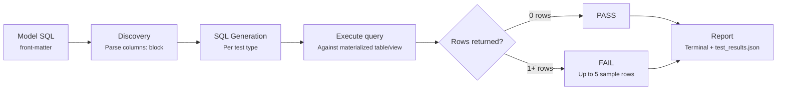

# Testing

Qraft includes a built-in data testing framework that validates your models after they run. Tests are defined in the YAML front-matter of your `.sql` model files and generate SQL queries under the hood. A test **passes** when its query returns zero rows; any rows returned are **failures**.

## Quick Start

Add a `columns:` block to your model's front-matter:

```sql
---
columns:
  - name: order_id
    tests:
      - not_null
      - unique
  - name: status
    tests:
      - accepted_values:
          values: [pending, shipped, delivered]
---
SELECT order_id, status FROM source('raw', 'orders')
```

Run your tests:

```bash
qraft test --env dev                    # test all models
qraft build --env dev                   # run models + test in one step
qraft test --env dev --select stg_*     # test models matching a prefix
qraft test --env dev --select tag:gold  # test models with a specific tag
```

## How Tests Work



1. **Discovery** -- Qraft reads the `columns:` block from each model's YAML front-matter and extracts test definitions.
2. **SQL Generation** -- Each test definition is compiled into a SQL query designed to return failing rows.
3. **Execution** -- The query runs against the materialized model table/view. If there are failures, Qraft fetches up to 5 example rows to help you debug.
4. **Reporting** -- Results are printed to the terminal and written to `target/test_results.json` for programmatic consumption.

The key principle: **rows returned = failures**. Every test query is constructed so that an empty result set means the test passes.

---

## Built-in Test Types

### `not_null`

Asserts that a column contains no NULL values.

**Parameters:** none

**Front-matter:**

```yaml
columns:
  - name: customer_id
    tests:
      - not_null
```

**Generated SQL:**

```sql
SELECT * FROM schema.model WHERE customer_id IS NULL
```

Any row where the column is NULL is a failure. This is one of the most common tests -- use it on primary keys, foreign keys, and any column that should always have a value.

---

### `unique`

Asserts that a column contains no duplicate values.

**Parameters:** none

**Front-matter:**

```yaml
columns:
  - name: email
    tests:
      - unique
```

**Generated SQL:**

```sql
SELECT email, COUNT(*) AS _qraft_count
FROM schema.model
GROUP BY email
HAVING COUNT(*) > 1
```

Returns groups that appear more than once. Combine with `not_null` on primary key columns to enforce a proper uniqueness constraint (since SQL `UNIQUE` constraints typically allow multiple NULLs).

---

### `accepted_values`

Asserts that every value in a column belongs to an allowed set.

**Parameters:**

| Parameter | Required | Description |
|-----------|----------|-------------|
| `values`  | yes      | List of allowed values |

**Front-matter:**

```yaml
columns:
  - name: status
    tests:
      - accepted_values:
          values: [pending, shipped, delivered, cancelled]
```

**Generated SQL:**

```sql
SELECT * FROM schema.model
WHERE status NOT IN ('pending', 'shipped', 'delivered', 'cancelled')
```

Returns any row whose value isn't in the allowed list. Useful for enum-like columns, status fields, and category columns. NULL values are _not_ flagged by this test (since `NULL NOT IN (...)` evaluates to NULL, not TRUE). If you also want to catch NULLs, add a separate `not_null` test.

---

### `relationships`

Asserts referential integrity -- every non-NULL value in a column exists in another model's column.

**Parameters:**

| Parameter | Required | Description |
|-----------|----------|-------------|
| `to`      | yes      | Target model, written as `ref('model_name')` |
| `field`   | yes      | Column name in the target model |

**Front-matter:**

```yaml
columns:
  - name: customer_id
    tests:
      - relationships:
          to: ref('stg_customers')
          field: customer_id
```

**Generated SQL:**

```sql
SELECT * FROM schema.stg_orders
WHERE customer_id IS NOT NULL
AND customer_id NOT IN (SELECT customer_id FROM schema.stg_customers)
```

The `ref('model_name')` syntax is resolved at test time -- the referenced model is qualified with the same schema as the model under test. NULL values in the source column are excluded (a NULL foreign key is not considered a violation).

---

### `accepted_range`

Asserts that every value in a numeric column falls within a given range.

**Parameters:**

| Parameter   | Required | Description |
|-------------|----------|-------------|
| `min_value` | no*      | Minimum allowed value (inclusive) |
| `max_value` | no*      | Maximum allowed value (inclusive) |

\* At least one of `min_value` or `max_value` must be provided. You can also use `min` / `max` as shorthand aliases.

**Front-matter:**

```yaml
columns:
  - name: quantity
    tests:
      - accepted_range:
          min_value: 1
          max_value: 1000
```

**Generated SQL:**

```sql
SELECT * FROM schema.model WHERE quantity < 1 OR quantity > 1000
```

Returns rows where the value falls outside the range. You can specify just one bound:

```yaml
# Only a lower bound
- accepted_range:
    min_value: 0
```

```sql
SELECT * FROM schema.model WHERE amount < 0
```

---

### `number_of_rows`

Asserts that a model contains at least a minimum number of rows. Unlike other tests, this is a **model-level** test -- it doesn't validate individual column values but ensures the table isn't unexpectedly empty or underpopulated.

**Parameters:**

| Parameter   | Required | Default | Description |
|-------------|----------|---------|-------------|
| `min_value` | no       | 1       | Minimum row count |

You can also use `min` as a shorthand alias.

**Front-matter:**

```yaml
columns:
  - name: _model
    tests:
      - number_of_rows:
          min_value: 100
```

**Generated SQL:**

```sql
SELECT CASE WHEN COUNT(*) < 100 THEN 1 ELSE 0 END AS _qraft_fail
FROM schema.model
HAVING COUNT(*) < 100
```

The query returns a single row if the count is below the threshold, and zero rows if the count meets or exceeds it. Since this is a model-level check, use any column name (like `_model`) as a placeholder in the `columns:` block.

> **Note:** Without any parameters, `number_of_rows` defaults to `min_value: 1`, which simply asserts the table is not empty.

---

### `unique_combination_of_columns`

Asserts that a combination of columns is unique across all rows -- a compound uniqueness constraint.

**Parameters:**

| Parameter     | Required | Description |
|---------------|----------|-------------|
| `combination` | yes      | List of column names that must be unique together |

You can also use `columns` as an alias for `combination`.

**Front-matter:**

```yaml
columns:
  - name: _model
    tests:
      - unique_combination_of_columns:
          combination: [date, product_id, store_id]
```

**Generated SQL:**

```sql
SELECT date, product_id, store_id, COUNT(*) AS _qraft_count
FROM schema.model
GROUP BY date, product_id, store_id
HAVING COUNT(*) > 1
```

Returns groups that appear more than once. Like `number_of_rows`, this is a model-level test, so use any column name as a placeholder.

---

## Test Configuration

### Severity

By default, a failing test has `error` severity, which causes `qraft test` to exit with a non-zero status code. Set severity to `warn` to report the failure without failing the run:

```yaml
columns:
  - name: discount
    tests:
      - accepted_range:
          min_value: 0
          max_value: 100
          severity: warn
```

### WHERE Filter

Add a `where` clause to narrow the test's scope. The filter is applied by wrapping the test query in a subquery:

```yaml
columns:
  - name: amount
    tests:
      - accepted_range:
          min_value: 0
          where: "status != 'cancelled'"
```

**Generated SQL:**

```sql
SELECT * FROM (
    SELECT * FROM schema.model WHERE amount < 0
) _qraft_filtered
WHERE status != 'cancelled'
```

This lets you exclude known exceptions (e.g., cancelled orders may have negative amounts) without disabling the test entirely.

---

## Front-matter Formats

Qraft supports two column definition formats. Both work identically.

### List format (dbt-style, recommended)

```yaml
columns:
  - name: order_id
    description: Unique order identifier
    tests:
      - not_null
      - unique
  - name: status
    tests:
      - accepted_values:
          values: [pending, shipped]
```

### Dict format

```yaml
columns:
  order_id:
    tests:
      - not_null
      - unique
  status:
    tests:
      - accepted_values:
          values: [pending, shipped]
```

The list format allows adding `description` metadata alongside tests, which is useful for documentation.

---

## Model Selection

Filter which models to test using the `--select` option:

| Syntax          | Behavior |
|-----------------|----------|
| `stg_orders`    | Exact model name |
| `stg_*`         | Prefix wildcard |
| `tag:bronze`    | All models with the given tag |

Tags are defined in the model's front-matter:

```yaml
---
tags: [bronze, crm]
columns:
  - name: account_id
    tests:
      - not_null
---
```

---

## Fail-Fast Mode

Use `--fail-fast` to stop on the first `error`-severity test failure:

```bash
qraft test --env dev --fail-fast
```

Tests with `severity: warn` do not trigger fail-fast -- only `error` (the default) does.

---

## Test Results Output

After every test run, Qraft writes a `target/test_results.json` file with structured results. This file is useful for CI/CD pipelines, dashboards, or any tooling that needs programmatic access to test outcomes.

```json
{
  "metadata": {
    "env": "local",
    "schema": "analytics",
    "generated_at": "2026-03-08T14:30:00+00:00"
  },
  "summary": {
    "total": 5,
    "passed": 4,
    "failed": 1,
    "warned": 0,
    "errored": 0
  },
  "results": [
    {
      "model": "stg_orders",
      "column": "order_id",
      "test_type": "not_null",
      "severity": "error",
      "passed": true
    },
    {
      "model": "stg_orders",
      "column": "amount",
      "test_type": "accepted_range",
      "severity": "error",
      "passed": false,
      "params": { "min_value": 0 },
      "failures_count": 2,
      "failures_sample": [["4", "-10"], ["7", "-5"]]
    }
  ]
}
```

The file is overwritten on each run. Failing tests include `failures_count` (capped at the sample window, not the true total) and up to 5 `failures_sample` rows. Tests with errors include an `error` message.

---

## Complete Example

```sql
---
materialization: table
tags: [gold]
columns:
  - name: customer_id
    description: Unique customer identifier
    tests:
      - not_null
      - unique
  - name: total_orders
    description: Number of orders placed
    tests:
      - accepted_range:
          min_value: 0
  - name: lifetime_spend
    description: Total amount spent
    tests:
      - accepted_range:
          min_value: 0
          severity: warn
  - name: customer_tier
    description: Tier based on lifetime spend
    tests:
      - accepted_values:
          values: [bronze, silver, gold]
  - name: _model
    tests:
      - number_of_rows:
          min_value: 1
      - unique_combination_of_columns:
          combination: [customer_id, customer_tier]
---
SELECT
    c.customer_id,
    c.customer_name,
    COUNT(o.order_id) AS total_orders,
    SUM(o.amount)     AS lifetime_spend,
    classify_tier(SUM(o.amount)) AS customer_tier
FROM ref('stg_customers') c
LEFT JOIN ref('stg_orders') o ON c.customer_id = o.customer_id
GROUP BY c.customer_id, c.customer_name
```

This model has 7 tests that run automatically with `qraft test` or `qraft build`:

- `customer_id` must be non-null and unique
- `total_orders` must be >= 0
- `lifetime_spend` must be >= 0 (warns but doesn't fail)
- `customer_tier` must be one of bronze/silver/gold
- The table must have at least 1 row
- Each (customer_id, customer_tier) pair must be unique
