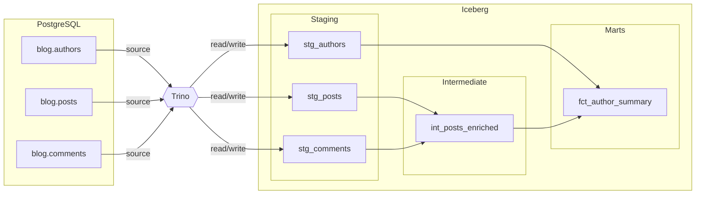

# Blog Analytics

A minimal example demonstrating Qraft's core features: `ref()`, `source()`, `{{ var }}`, and the `qraft_utils` macro library. Reads from PostgreSQL via Trino, writes to an Iceberg lakehouse.

## Data Model

Three raw source tables from a PostgreSQL blog database feed a three-layer pipeline:



| Layer        | Models                                              | Description                    |
|--------------|-----------------------------------------------------|--------------------------------|
| staging      | `stg_authors`, `stg_posts`, `stg_comments`          | Clean and rename raw columns   |
| intermediate | `int_posts_enriched`                                 | Join posts + comments, add metrics |
| marts        | `fct_author_summary`                                 | Per-author stats (uses `qraft_utils.scalar` macro) |

## Prerequisites

Install the `qraft-utils` macro library (from the repo root):

```bash
uv pip install -e python/qraft-utils/
```

## Quick Start

```bash
cd examples/blog_analytics

# 1. Start the Docker stack (PostgreSQL source + Trino + Iceberg)
docker compose up -d

# 2. Validate the project
qraft validate --env docker

# 3. View the dependency graph
qraft dag

# 4. Compile SQL (preview without executing)
qraft compile --env docker

# 5. Run all models
qraft run --env docker
```

## Environments

| Environment | Engine | Notes                              |
|-------------|--------|------------------------------------|
| `docker`    | Trino  | PostgreSQL source + Iceberg target |
| `prod`      | Trino  | Overrides `min_post_length` to 100 |

## Project Variables

| Variable          | Default | Description                         |
|-------------------|---------|-------------------------------------|
| `min_post_length` | `0`     | Minimum post body length to include |
