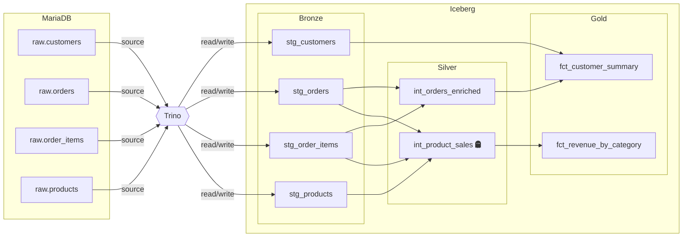

# E-commerce Basic

An example project showcasing ephemeral models, custom macros, and the bronze/silver/gold layer pattern. Reads from MariaDB via Trino, writes to an Iceberg lakehouse.

## Data Model

Four raw source tables from a MariaDB e-commerce database feed an 8-model pipeline:



| Layer  | Models | Description |
|--------|--------|-------------|
| bronze | `stg_customers`, `stg_orders`, `stg_order_items`, `stg_products` | Clean and rename |
| silver | `int_orders_enriched`, `int_product_sales` (ephemeral) | Joins and aggregations |
| gold   | `fct_customer_summary`, `fct_revenue_by_category` | Business metrics |

### Notable Features

- **Ephemeral model**: `int_product_sales` is materialized as `ephemeral` -- it's inlined as a CTE into `fct_revenue_by_category` instead of being created as a view/table.
- **Custom macros**: `ecommerce_utils.py` provides `classify_tier()` for customer segmentation using project variables.
- **`qraft_utils` macros**: `fct_revenue_by_category` uses `safe_divide()` from the shared macro library.

## Prerequisites

Install the `qraft-utils` macro library (from the repo root):

```bash
uv pip install -e python/qraft-utils/
```

## Quick Start

```bash
cd examples/ecommerce_basic

# 1. Start the Docker stack (MariaDB source + Trino + Iceberg)
docker compose up -d

# 2. Validate the project
qraft validate --env docker

# 3. View the dependency graph
qraft dag

# 4. Compile SQL (preview without executing)
qraft compile --env docker

# 5. Run all models
qraft run --env docker
```

## Environments

| Environment | Engine | Notes                              |
|-------------|--------|------------------------------------|
| `docker`    | Trino  | MariaDB source + Iceberg target    |
| `prod`      | Trino  | Overrides `min_order_amount` to 10 |

## Project Variables

| Variable           | Default | Description                    |
|--------------------|---------|--------------------------------|
| `min_order_amount` | `0`     | Minimum order total to include |
| `gold_threshold`   | `200`   | Lifetime spend for gold tier   |
| `silver_threshold` | `100`   | Lifetime spend for silver tier |
