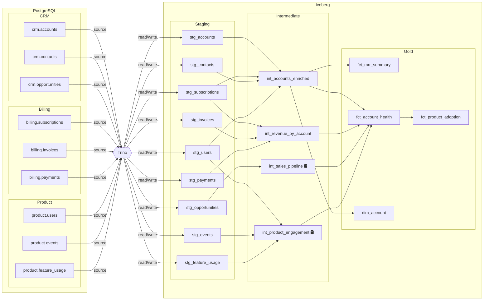

# SaaS Analytics

A comprehensive example demonstrating multi-source projects, per-model schema overrides, custom macros, and a 4-layer DAG. Reads from PostgreSQL via Trino, writes to an Iceberg lakehouse.

## Data Model

Nine raw source tables across three systems feed a 17-model pipeline:



| Layer            | Models | Description |
|------------------|--------|-------------|
| staging (9)      | `stg_accounts`, `stg_contacts`, `stg_opportunities`, `stg_subscriptions`, `stg_invoices`, `stg_payments`, `stg_users`, `stg_events`, `stg_feature_usage` | Clean and rename |
| intermediate (4) | `int_accounts_enriched`, `int_revenue_by_account`, `int_sales_pipeline`, `int_product_engagement` | Cross-source joins |
| gold (4)         | `fct_mrr_summary`, `fct_account_health`, `fct_product_adoption`, `dim_account` | Business metrics and dimensions |

### Notable Features

- **Multiple data sources**: CRM, billing, and product telemetry systems.
- **Per-model schema override**: `dim_account` writes to a `dimensions` schema instead of the default `analytics` schema.
- **Custom macros**: `saas_utils.py` provides `health_score()` and `revenue_tier()`.
- **`qraft_utils` macros**: `fct_account_health` uses macros from the shared library.
- **4-layer DAG**: `fct_product_adoption` depends on `fct_account_health`, creating a fourth layer.

## Prerequisites

Install the `qraft-utils` macro library (from the repo root):

```bash
uv pip install -e python/qraft-utils/
```

## Quick Start

```bash
cd examples/saas_analytics

# 1. Start the Docker stack (PostgreSQL source + Trino + Iceberg)
docker compose up -d

# 2. Validate the project
qraft validate --env docker

# 3. View the dependency graph
qraft dag

# 4. Compile SQL (preview without executing)
qraft compile --env docker

# 5. Run all models
qraft run --env docker
```

## Environments

| Environment | Engine | Notes                                 |
|-------------|--------|---------------------------------------|
| `docker`    | Trino  | PostgreSQL source + Iceberg target    |
| `staging`   | Trino  | Uses `analytics_staging` schema       |
| `prod`      | Trino  | Overrides `churn_inactive_days` to 60 |

## Project Variables

| Variable                  | Default | Description                        |
|---------------------------|---------|------------------------------------|
| `trial_days`              | `14`    | Trial period length                |
| `churn_inactive_days`     | `30`    | Days of inactivity before churn    |
| `mrr_currency`            | `USD`   | Currency for MRR reporting         |
| `healthy_mrr_threshold`   | `10000` | MRR threshold for "healthy" status |
| `at_risk_event_threshold` | `5`     | Min events before flagging at-risk |
